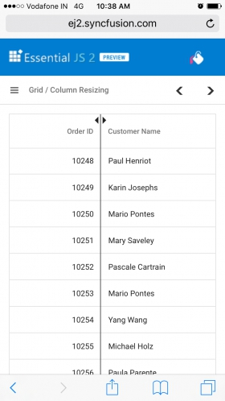

# Column resizing in Angular Grid component

Columns width can be resized by clicking and dragging at the right edge of the column header. While dragging, the width of a respective column will be resized immediately. Each column can be auto resized by double-clicking at the right edge of the column header. It will fit the width of that column based on widest cell content. To enable the column resize, set the [`allowResizing`](https://ej2.syncfusion.com/angular/documentation/api/grid/#allowresizing) property to true.

To use the column resize, inject **ResizeService** in the provider section of **AppModule**.












  


> You can disable Resizing for a particular column, by specifying [`columns.allowResizing`](https://ej2.syncfusion.com/angular/documentation/api/grid/columnDirective/#allowresizing) to false.

> In RTL mode, you can click and drag the left edge of header cell to resize the column.

## Min and max width

Columns can be restricted to resize in between minimum and maximum width by defining the [`columns.minWidth`](https://ej2.syncfusion.com/angular/documentation/api/grid/columnDirective/#minwidth) and [`columns.maxWidth`](https://ej2.syncfusion.com/angular/documentation/api/grid/columnDirective/#maxwidth).

In the below sample, **OrderID**, **Ship Name** and **Ship Country** columns are defined with minimum and maximum width.












  


> The `maxWidth` and `minWidth` properties will be considered only when the user resizes the column. When resizing the window, these properties will not be considered. This is because columns cannot be re-rendered when resizing the window.

## Resize stacked column

Stacked columns can be resized by clicking and dragging the right edge of the stacked column header. While dragging, the width of the respective child columns will be resized at the same time. You can disable resize for any particular stacked column by setting [`allowResizing`](https://ej2.syncfusion.com/angular/documentation/api/grid/columnDirective/#allowresizing) as **false** to its columns.

In this example, we have disabled resize for **Ship City** column.












  


## Touch interaction

When you tap at the right edge of header cell, a floating handler will be visible over the right border of the column. To resize the column, tap and drag the floating handler as much you need. You can also autoFit a column by using the Column menu of the grid.

The following screenshot represents the column resizing on the touch device.

## Resizing events

During the resizing action, the grid component triggers the below three events.

1.The [`resizeStart`](https://ej2.syncfusion.com/angular/documentation/api/grid/#resizestart) event triggers when column resize starts.

2.The [`resizing`](https://ej2.syncfusion.com/angular/documentation/api/grid/#resizing) event triggers when column header element is dragged (moved) continuously..

3.The [`resizeStop`](https://ej2.syncfusion.com/angular/documentation/api/grid/#resizestop) event triggers when column resize ends.












  
