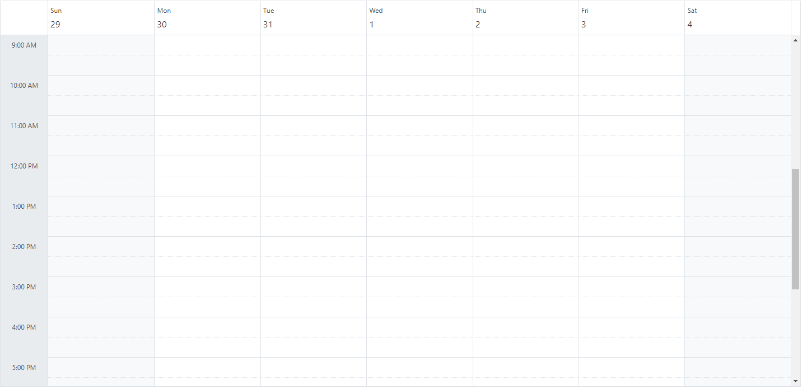
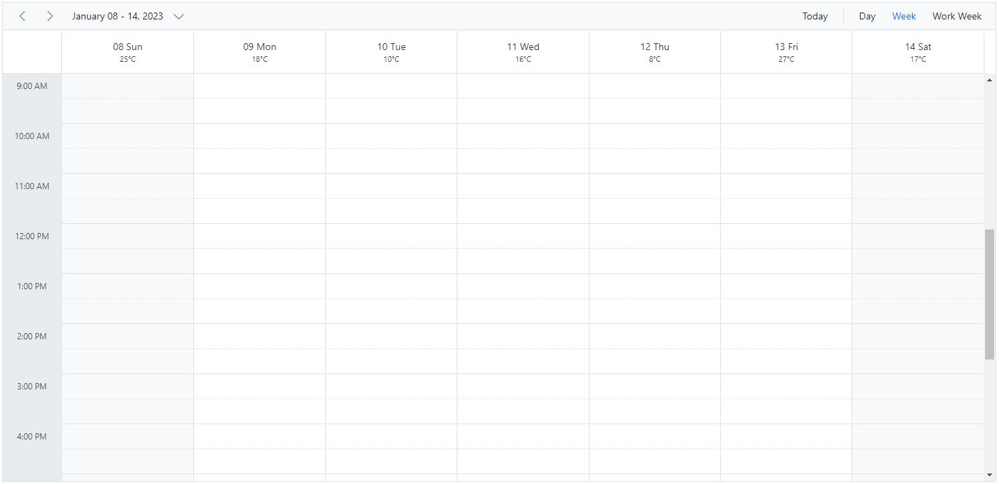

# Header bar in Angular Schedule component

The header part of Scheduler can be customized easily with the built-in options available.

## Show or Hide header bar

By default, the header bar holds the date and view navigation options, through which the user can switch between the dates and various views. This header bar can be hidden from the UI by setting `false` to the `showHeaderBar` property. It's default value is `true`.












  


## Customizing header bar

Apart from the default date navigation and view options available on the header bar, you can add custom items into the Scheduler header bar by making use of the `actionBegin` event. Here, an employee image is added to the header bar, clicking on which will open the popup showing that person's short profile information.












  


## How to display the view options within the header bar popup

By default, the header bar holds the view navigation options, through which the user can switch between various views. You can move this view options to the header bar popup by setting `true` to the `enableAdaptiveUI` property.












  


> Refer [here](./resources/#adaptive-ui-in-desktop) to know more about adaptive UI in resources scheduler.

## Date header customization

The Scheduler UI that displays the date text on all views are considered as the date header cells. You can customize the date header cells of Scheduler either using `dateHeaderTemplate` or `renderCell` event.

### Using date header template

The `dateHeaderTemplate` option is used to customize the date header cells of day, week and work-week views.












  


### Using renderCell event

In month view, the date header template is not applicable and therefore the same customization can be added beside the date text in month cells by making use of the `renderCell` event.












  


## Customizing the date range text

The [`dateRangeTemplate`](../api/schedule/#daterangetemplate) option allows you to customize the text content of the date range displayed in the scheduler. By default, the date range text is determined by the scheduler view being used. However, you can use the [`dateRangeTemplate`](../api/schedule/#daterangetemplate) option to override the default text and specify your own custom text to be displayed.

The [`dateRangeTemplate`](../api/schedule/#daterangetemplate) property includes `startDate`, `endDate` and `currentView` options, you can customize the date range text using these available options.












  


## Customizing header indent cells

It is possible to customize the header indent cells using the `headerIndentTemplate` option and change the look and appearance in both the vertical and timeline views. In vertical views, You can customize the header indent cells at the hierarchy level and you can customize the resource header left indent cell in timeline views using the template option.

**Example:** To customize the header left indent cell to display resources text, refer to the below code example.












  


> You can refer to our [Angular Scheduler](https://www.syncfusion.com/angular-ui-components/angular-scheduler) feature tour page for its groundbreaking feature representations. You can also explore our [Angular Scheduler example](https://ej2.syncfusion.com/angular/demos/#/material/schedule/overview) to knows how to present and manipulate data.
