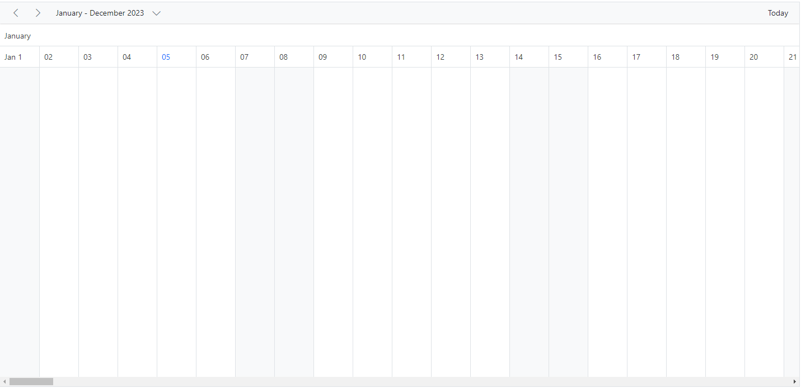

# Header rows in Angular Schedule component

The Timeline views can have additional header rows other than its default date and time header rows. It is possible to show individual header rows for displaying year, month and week separately using the `headerRows` property. This property is applicable only on the timeline views. The possible rows which can be added using `headerRows` property are as follows.

* `Year`
* `Month`
* `Week`
* `Date`
* `Hour`

> The `Hour` row is not applicable for Timeline month view.

Learn to add and customize additional header rows in the Timeline views of Angular Scheduler from this video:



The following example shows the Scheduler displaying all the available header rows on timeline views.












  


## Display year and month rows in timeline views

To display the timeline Scheduler simply with year and month names alone, define the option `Year` and `Month` within the `headerRows` property.












  


## Display week numbers in timeline views

The week number can be displayed in a separate header row of the timeline Scheduler by setting `Week` option within `headerRows` property.












  


## Timeline view displaying dates of a complete year

It is possible to display a complete year in a timeline view by setting `interval` value as 12 and defining **TimelineMonth** view option within the `views` property of Scheduler.












  


## Customizing the header rows using template

You can customize the text of the header rows and display any images or formatted text on each individual header rows using the built-in `template` option available within the `headerRows` property.












  


> You can refer to our [Angular Scheduler](https://www.syncfusion.com/angular-ui-components/angular-scheduler) feature tour page for its groundbreaking feature representations. You can also explore our [Angular Scheduler example](https://ej2.syncfusion.com/angular/demos/#/material/schedule/overview) to knows how to present and manipulate data.
