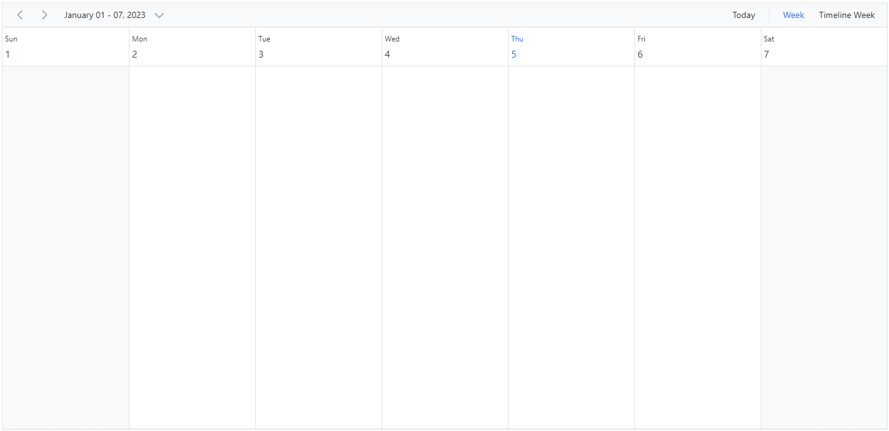
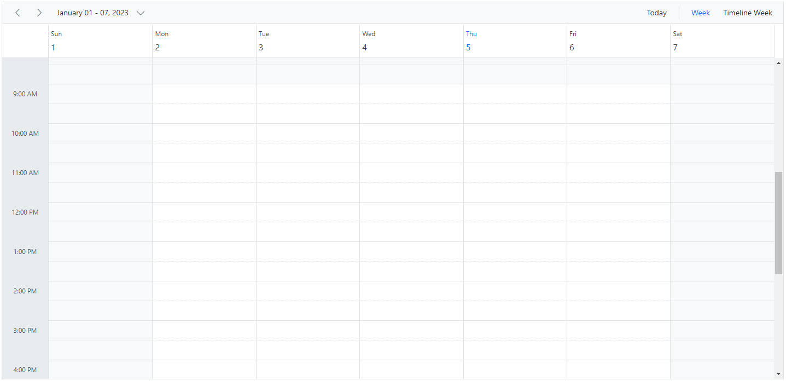

# Timescale in Angular Schedule component

The time slots are usually the time cells that are displayed on the Day, Week and Work Week views of both the vertical views (to the left most position) and timeline views (at the top position). The `timeScale` property allows you to control and set the required time slot duration for the work cells displayed on Scheduler. It includes the following sub-options such as,

* `enable` - When set to `true`, allows the Scheduler to display the appointments accurately against the exact time duration. If set to `false`, all the appointments of a day will be displayed one below the other with no grid lines displayed. Its default value is `true`.
* `interval` – Defines the time duration on which the time axis to be displayed either in 1 hour or 30 minutes interval and so on. It accepts the values in minutes and defaults to 60.
* `slotCount` – Decides the number of slot count to be split for the specified time interval duration. It defaults to 2, thus displaying two slots to represent an hour(each slot depicting 30 minutes duration).

## Setting different time slot duration

The `interval` and `slotCount` properties can be used together on the Scheduler to set different time slot duration which is depicted in the following code example. Here, six time slots together represents an hour.












  


## Customizing time cells using template

The `timeScale` property also provides template option to allow customization of time slots which are as follows,

* `majorSlotTemplate` - The template option to be applied for major time slots. Here, the template accepts either the string or HTMLElement as template design and then the parsed design is displayed onto the time cells. The time details can be accessed within this template.
* `minorSlotTemplate` - The template option to be applied for minor time slots. Here, the template accepts either the string or HTMLElement as template design and then the parsed design is displayed onto the time cells. The time details can be accessed within this template.















  


## Hide the timescale

The grid lines which indicates the exact time duration can be enabled or disabled on the Scheduler, by setting `true` or `false` to the `enable` option within the `timeScale` property. It's default value is `true`.












  


## Highlighting current date and time

By default, Scheduler indicates current date with a highlighted date header on all views, as well as marks accurately the system's current time on specific views such as Day, Week, Work Week, Timeline Day, Timeline Week and Timeline Work Week views. To stop highlighting the current time indicator on Scheduler views, set `false` to the `showTimeIndicator` property which defaults to `true`.












  


> You can refer to our [Angular Scheduler](https://www.syncfusion.com/angular-ui-components/angular-scheduler) feature tour page for its groundbreaking feature representations. You can also explore our [Angular Scheduler example](https://ej2.syncfusion.com/angular/demos/#/material/schedule/overview) to knows how to present and manipulate data.
